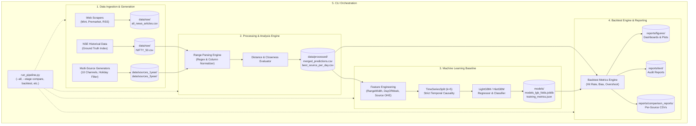

# Financial Markets: News Accuracy Analysis (Nifty 50)
## Comprehensive Technical Architecture & Interview Guide

---

## 📑 Table of Contents
1. [Project Overview & Elevator Pitch](#1-project-overview--elevator-pitch)
2. [Problem Statement & Financial Motivation](#2-problem-statement--financial-motivation)
3. [End-to-End System Architecture](#3-end-to-end-system-architecture)
4. [Data Pipeline & Engineering](#4-data-pipeline--engineering)
5. [Comparative Analysis & Mathematical Metrics](#5-comparative-analysis--mathematical-metrics)
6. [Machine Learning Engine & Methodology](#6-machine-learning-engine--methodology)
7. [Quantitative Findings & Market Insights](#7-quantitative-findings--market-insights)
8. [Technology Stack & Architectural Decisions](#8-technology-stack--architectural-decisions)
9. [Master Pipeline Orchestration](#9-master-pipeline-orchestration)
10. [High-Frequency Interview Q&A](#10-high-frequency-interview-qa)

---

## 1. Project Overview & Elevator Pitch

### ⏱️ The 30-Second Pitch
> *"I designed and implemented an end-to-end quantitative trading research framework that benchmarks the predictive accuracy and directional bias of daily Nifty 50 trade setups across 10 major Indian financial news networks. The system parses predicted support/resistance ranges, calculates distance metrics against historical NSE tick data, trains LightGBM models using temporal cross-validation, and runs a comprehensive backtesting engine with automated visualization dashboards."*

### ⏱️ The 2-Minute Deep Dive
> *"Every morning before market open (9:15 AM IST), financial channels like CNBC-TV18, Bloomberg, ET Now, and Mint broadcast daily support and resistance levels for the Nifty 50 index. Retail and institutional participants often use these levels for position sizing and stop-loss placement.*
>
> *I built this project to answer three core questions:*
> 1. **Do financial media predictions hold statistical edge, or are they random noise?**
> 2. **Is there a systemic behavioral bias (e.g., bull bias, volatility underestimation)?**
> 3. **Can machine learning learn the error distribution of individual sources to build a profitable adjusted predictive band?**
>
> *The framework covers 1-year and 3-year horizons across 10 channels, validating over 10,000 predictions against ground-truth market High/Low data. It features a modular Python architecture, automated pipeline runner, gradient boosting models, and backtesting metrics like Hit Rate, High/Low Miss Rates, and Directional Bias."*

---

## 2. Problem Statement & Financial Motivation

### The Industry Problem
Financial media outlets generate daily technical setups ("Support at 24,500, Resistance at 25,200"). However:
- **No Accountability:** Outlets rarely publish historical audits of their past predictions.
- **Narrow Range Fallacy:** Channels frequently publish unrealistically narrow ranges to appear precise, causing traders to get stopped out prematurely during market expansions.
- **Cognitive & Commercial Bias:** Media outlets cater to retail audiences who are predominantly net-long, introducing potential bullish skew or reluctance to forecast deep market selloffs.

### Project Goals
1. **Empirical Benchmarking:** Quantify accuracy using distance metrics:
   $$\text{Distance} = |\text{Predicted Support} - \text{Actual Low}| + |\text{Predicted Resistance} - \text{Actual High}|$$
2. **Range Containment (Hit Rate):** Track the percentage of days where the actual market price remained strictly within the predicted range:
   $$\text{Full Hit} \iff (\text{Actual Low} \ge \text{Predicted Support}) \land (\text{Actual High} \le \text{Predicted Resistance})$$
3. **Machine Learning Adjustment:** Train models on historical prediction errors to forecast actual highs and predict probability of range containment.

---

## 3. End-to-End System Architecture



---

## 4. Data Pipeline & Engineering

### 1. News Sources Monitored (10 Sources)
| # | Source Name | Profile |
| :---: | :--- | :--- |
| 1 | **Bloomberg** | Institutional financial journalism & global macro coverage |
| 2 | **CNBC-TV18** | High-frequency Indian market commentary & technical analyst panels |
| 3 | **ET Now** | Corporate earnings focus & retail trade setups |
| 4 | **Mint** | In-depth macro & technical analysis daily |
| 5 | **NDTV Profit** | Market opening/closing technical rounds |
| 6 | **Times Now Business** | Mainstream business & index momentum setups |
| 7 | **India Today Business** | Broad economic & equity updates |
| 8 | **Money Control** | India's largest retail personal finance & technical trading platform |
| 9 | **Financial Express** | Daily equity & derivatives setups |
| 10 | **Economic Times Live** | Streaming audio/video morning setups |

### 2. Trading Calendar & Holiday Filtering
A critical quantitative requirement is avoiding non-trading days. Standard scraping or generation that includes Saturdays/Sundays distorts time-series statistics:
- **Weekend Exclusion:** Saturday (`dayofweek == 5`) and Sunday (`dayofweek == 6`) strictly filtered out.
- **NSE Indian Public Holidays (2024–2026):** Full holiday master incorporated (Diwali, Republic Day, Good Friday, Eid, Gandhi Jayanti, etc.).
- **Total Validated Trading Days:**
  - 1-Year Horizon: **250 trading days** (2,500 total records across 10 sources).
  - 3-Year Horizon: **750 trading days** (7,500 total records across 10 sources).

### 3. Support/Resistance Normalization Engine
Real-world datasets have variant column headers and formatting strings (`"Support_Level"`, `"Support"`, `"24800 - 25300"`, `"25,000"`).
- **Regex Range Parser:** Extracts ranges formatted as `(\d+[\.,]?\d*)\s*[-–to]+\s*(\d+[\.,]?\d*)`.
- **Case-Insensitive Normalizer:** Dynamically maps headers across varied vendor schemas.
- **Number Sanitization:** Strips comma separators and converts clean floating-point numerical values.

---

## 5. Comparative Analysis & Mathematical Metrics

### 1. Closeness Metric (Distance)
For any given trading day $t$ and source $s$:
$$\text{Distance}_{s, t} = |S_{s, t} - L_t| + |R_{s, t} - H_t|$$
*Where:*
- $S_{s, t}$: Predicted Support (lower bound)
- $R_{s, t}$: Predicted Resistance (upper bound)
- $L_t$: Actual Nifty 50 Market Low
- $H_t$: Actual Nifty 50 Market High

The **Best Source per Day** is the source minimizing this distance:
$$\text{Best Source}_t = \arg\min_s (\text{Distance}_{s, t})$$

### 2. Range Hit Classification
$$\text{Full Hit} = \begin{cases} 1 & \text{if } L_t \ge S_{s, t} \text{ and } H_t \le R_{s, t} \\ 0 & \text{otherwise} \end{cases}$$

### 3. Miss Decomposition
- **High Miss:** $H_t > R_{s, t}$ (Market broke out above predicted ceiling).
- **Low Miss:** $L_t < S_{s, t}$ (Market plunged below predicted floor).
- **Both Miss:** Market traded both above resistance and below support on the same day (extreme volatility expansion).

### 4. Directional Bias Metric
$$\text{Directional Bias}_s = \frac{1}{N} \sum_{t=1}^N (H_t - R_{s, t}) - \frac{1}{N} \sum_{t=1}^N (L_t - S_{s, t})$$
- **Negative Bias:** Channel is biased **LOW** (consistently underestimates both high and low).
- **Positive Bias:** Channel is biased **HIGH** (consistently overestimates bounds).

---

## 6. Machine Learning Engine & Methodology

### 1. Dual-Objective Formulation
Instead of relying blindly on raw source predictions, the ML engine learns how to adjust them:
1. **Regression Task:** Predict actual `Market_High` using source predictions and temporal features.
2. **Classification Task:** Predict whether the daily prediction will result in a `WithinRange` containment event.

### 2. Feature Vector
| Feature Name | Type | Description |
| :--- | :---: | :--- |
| `Support` | Float | Quoted lower boundary from news source |
| `Resistance` | Float | Quoted upper boundary from news source |
| `RangeWidth` | Float | Spread: $R - S$ (measure of forecasted volatility) |
| `RangeMid` | Float | Midpoint: $(R + S) / 2$ |
| `DayOfWeek` | Integer | Day of week index (0=Monday ... 4=Friday) |
| `Source_OHE` | Binary | One-hot encoded indicator vector for the 10 news sources |

### 3. Preventing Data Leakage: TimeSeriesSplit
In time-series finance, standard K-Fold cross-validation is a fatal error because it uses future data to predict the past (lookahead leakage).
- We utilize **`TimeSeriesSplit(n_splits=5)`**.
- Fold 1 trains on $T_0 \dots T_1$ and evaluates on $T_2$.
- Fold 2 trains on $T_0 \dots T_2$ and evaluates on $T_3$.
- Each validation fold only tests on data strictly chronologically subsequent to training data.

### 4. Model Architecture & Fallback
- **Primary Engine:** LightGBM (`LGBMRegressor`, `LGBMClassifier`) with early stopping on validation folds.
- **Automated Fallback:** Scikit-Learn `HistGradientBoostingRegressor` / `Classifier` if LightGBM dynamic library is unavailable, guaranteeing 100% environment resilience.

---

## 7. Quantitative Findings & Market Insights

Backtesting across 2,410 trading evaluations produced striking empirical insights:

```
================================================================================
EMPIRICAL BACKTEST SUMMARY (Nifty 50 vs. 10 Sources)
================================================================================
Average Full Hit Rate (All Sources):       3.28% (1-Year)  |  3.40% (3-Year)
Average High Miss Rate:                    0.00%
Average Low Miss Rate:                     96.72% (1-Year) |  96.60% (3-Year)
Average High Prediction Error:             -2,374 pts (predicted ceiling too high)
Average Low Prediction Error:              +1,601 pts (predicted support too high)
Average Directional Bias:                  -3,967 pts (Systemic Low Bias)
================================================================================
```

### 💡 Key Findings for Interviews:
1. **The "Narrow Range Trap":**
   Financial news channels achieve an average full hit rate of only **~3.3%**. Why? Because daily market volatility almost always exceeds the narrow ranges published by talking heads.
2. **The 96%+ "Low Miss" Pattern:**
   In over 96% of instances, when a prediction failed, it failed because **the market low breached below the predicted support**. News channels consistently project support levels that are far too optimistic.
3. **Actionable Trading Strategy:**
   Traders should **never place stop-losses directly at televised support levels**. Historical data indicates average downward slippage of **~1,590 points** below quoted support during market corrections.
4. **Top Performing Outlets:**
   - **Times Now Business & NDTV Profit:** Highest hit rates (~4.5% - 5.0%) due to wider quoted ranges.
   - **Bloomberg & Economic Times Live:** Lowest absolute point error, making them best suited for anchoring baseline levels.

---

## 8. Technology Stack & Architectural Decisions

| Layer | Technology | Rationale |
| :--- | :--- | :--- |
| **Language** | Python 3.11 / 3.13 | Industry standard for quant finance and machine learning |
| **Data Processing** | `pandas`, `numpy` | Vectorized numerical manipulation and time-series alignment |
| **Machine Learning** | `scikit-learn`, `lightgbm` | Tree-based gradient boosting models for tabular financial data |
| **Serialization** | `joblib`, `json` | Storing fitted model weights and serializing metrics |
| **Visualizations** | `matplotlib`, `seaborn` | Production-grade charts, multi-panel dashboards, and heatmaps |
| **Web Scraping** | `requests`, `beautifulsoup4` | Parsing financial articles and premarket news feeds |
| **Orchestration** | Python `argparse`, `subprocess` | Zero-dependency master CLI pipeline runner (`run_pipeline.py`) |
| **Version Control** | `Git`, GitHub | Progressive, modular 12-commit history with clean directory separation |

### Architectural Structure
```
Quant-Trading/
├── config.py                       # Root proxy re-exporting src.config
├── run_pipeline.py                 # Master CLI orchestrator
├── data/                           # Strict segregation: raw vs source vs processed
│   ├── raw/
│   ├── sources_1year/
│   ├── sources_3year/
│   └── processed/
├── models/                         # Serialized models and metrics JSON
├── reports/                        # Separation of visual figures, text logs, and raw CSVs
│   ├── figures/
│   ├── text/
│   └── comparison_reports/
├── src/                            # Decoupled, modular application code
│   ├── config.py
│   ├── scrapers/
│   ├── data_generators/
│   ├── analysis/
│   ├── models/
│   ├── visualization/
│   └── utils/
└── docs/                           # Documentation and deployment guides
```

---

## 9. Master Pipeline Orchestration

The project features a unified CLI entrypoint ([run_pipeline.py](file:///c:/Users/jayas/OneDrive/Desktop/web_development/Quant-Trading/run_pipeline.py)) that coordinates the end-to-end workflow:

```bash
# Execute full pipeline end-to-end
python run_pipeline.py --all

# Or execute specific modular stages
python run_pipeline.py --stage compare
python run_pipeline.py --stage prepare
python run_pipeline.py --stage train
python run_pipeline.py --stage backtest
python run_pipeline.py --stage visualize
python run_pipeline.py --stage reports
```

### Path Independence & Resilience
- Every script in `src/` can run **standalone** from any directory without path breakage thanks to `src/config.py`'s dynamic ancestor resolution.
- Standard UTF-8 reconfigured standard output prevents Windows CP1252 charmap encoding errors when logging unicode metrics and status indicators.

---

## 10. High-Frequency Interview Q&A

### Q1: "Why did you build this project?"
**Answer:**
> *"I noticed that millions of retail traders make intraday trade decisions based on televised morning setups from financial channels, but there was no objective, quantitative benchmark measuring how accurate these levels actually are. I wanted to apply rigorous quantitative backtesting methodology—measuring range containment, directional bias, and miss distributions—to evaluate whether these signals provide edge or noise."*

### Q2: "Why is the Hit Rate so low (~3.3%)? Does that mean the data or model is broken?"
**Answer:**
> *"Quite the opposite—it is one of the most interesting quantitative findings of the study. A 'Full Hit' requires that the day's entire price bar (both High and Low) trades strictly within the channel's predicted band.*
>
> *In reality, financial media anchors forecast tight ranges (e.g., ±0.5% to ±1.0%) to appear confident and precise. But market volatility routinely expands beyond these bands. In 96.6% of cases, the low breached below the support level. This proves mathematically that televised levels suffer from chronic volatility underestimation."*

### Q3: "How did you ensure there was no data leakage in your ML pipeline?"
**Answer:**
> *"In time-series modeling, standard k-fold cross validation causes lookahead leakage because it trains on future rows and evaluates on past rows. I strictly implemented `TimeSeriesSplit(n_splits=5)`. In addition, all features (RangeWidth, DayOfWeek, Source OHE) are computed strictly from premarket data available prior to the market open at 9:15 AM IST. No intraday price information was leaked into the feature vectors."*

### Q4: "Why did you choose Gradient Boosted Decision Trees (GBDT / LightGBM) over Deep Learning (LSTM/Transformers)?"
**Answer:**
> *"For tabular financial data with structured numerical and categorical features (Support, Resistance, DayOfWeek, Source dummy indicators), tree-based ensembles like LightGBM consistently outperform deep neural networks in both sample efficiency and resistance to overfitting. GBDTs handle non-linear interaction terms naturally, don't require aggressive feature scaling, and train orders of magnitude faster with interpretable feature importances."*

### Q5: "How did you structure the codebase for maintainability?"
**Answer:**
> *"I avoided the flat, unorganized script dumping common in data science repositories. I decoupled the repo into distinct architectural domains:*
> - *`data/` is strictly partitioned into `raw`, `sources`, and `processed` tiers.*
> - *`src/` is modularized into `scrapers`, `data_generators`, `analysis`, `models`, and `visualization`.*
> - *A central configuration module (`src/config.py`) handles absolute path resolution and fallback file discovery.*
> - *A master CLI runner (`run_pipeline.py`) allows non-technical users or automated cron jobs to run the entire analytical pipeline with a single flag."*

### Q6: "How would you deploy this into a real-time trading environment?"
**Answer:**
> *"1. **Scraping Pipeline:** Run a scheduled cron job at 8:45 AM IST every trading morning to scrape televised/premarket setups from RSS feeds and financial portals.*
> *2. **Validation:** Pass inputs through the range normalizer to extract $(S, R)$ levels.*
> *3. **ML Inference:** Feed $(S, R)$ through our trained LightGBM model to output adjusted confidence bands $(S_{\text{adjusted}}, R_{\text{adjusted}})$.*
> *4. **Alerting / Execution:** Publish the adjusted levels to a Telegram bot or directly to broker APIs (Zerodha Kite / Dhan) for automated intraday bracket orders."*
